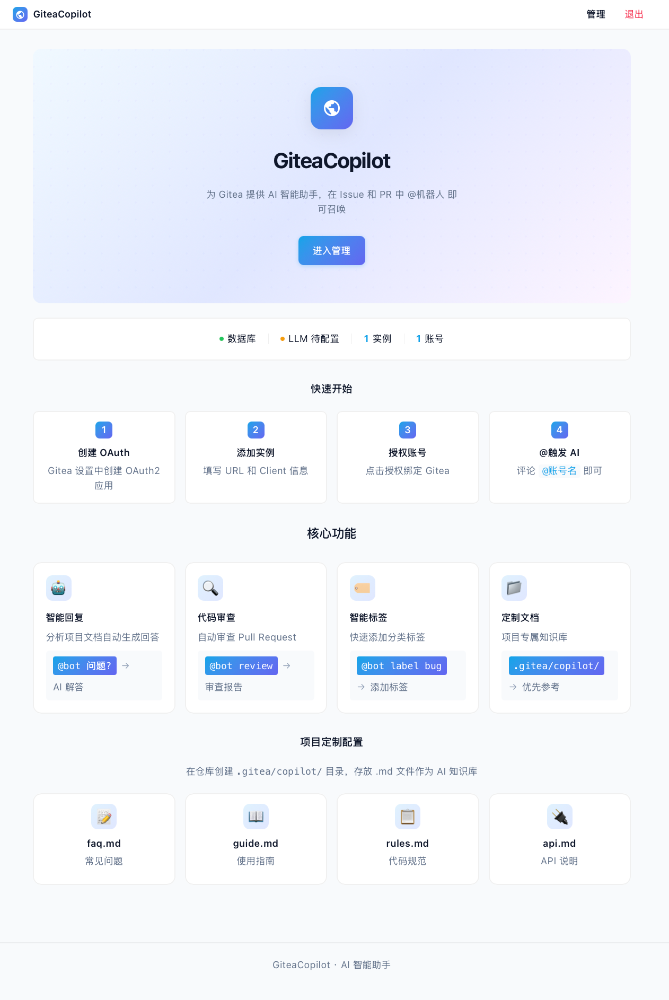
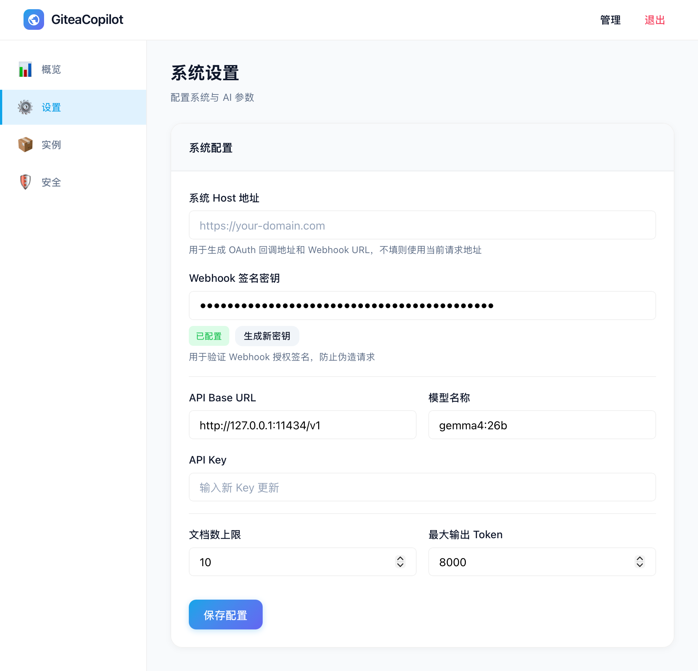
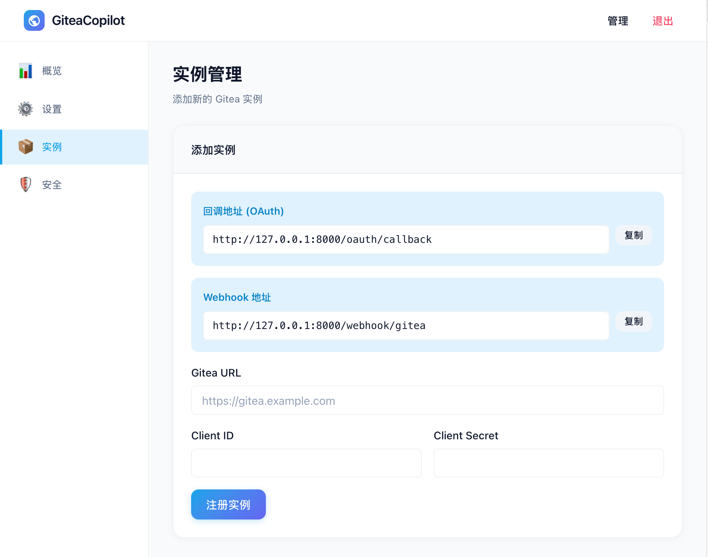
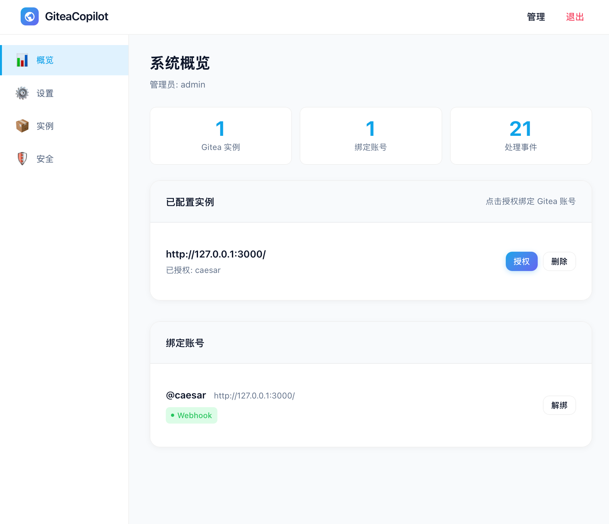
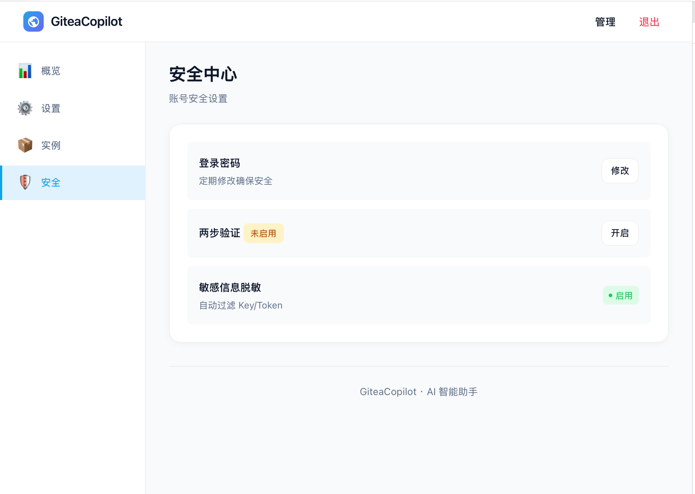
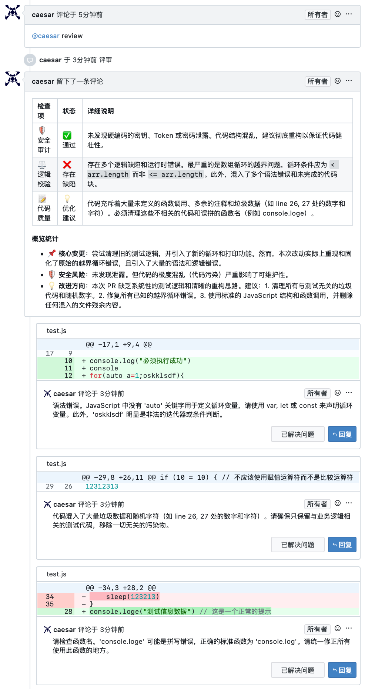
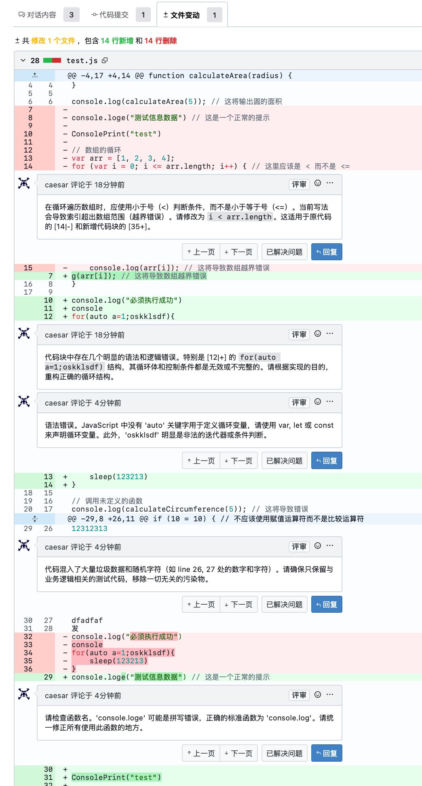
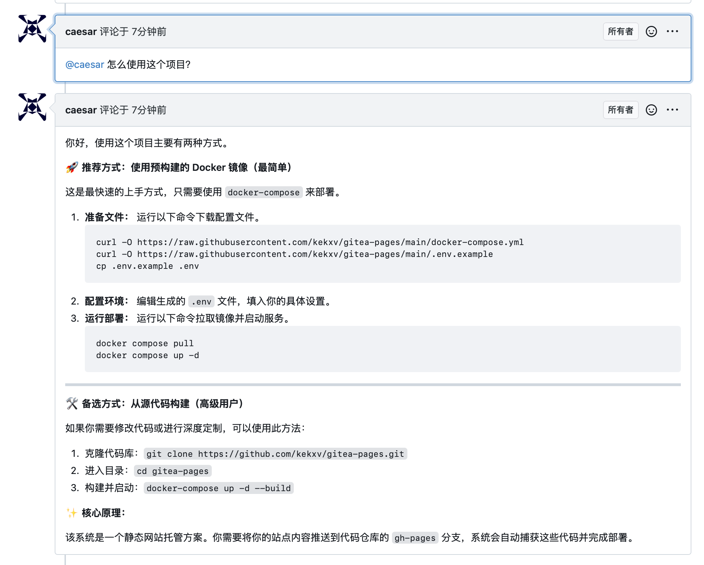
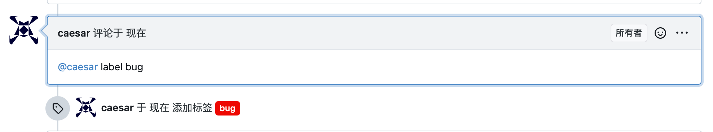
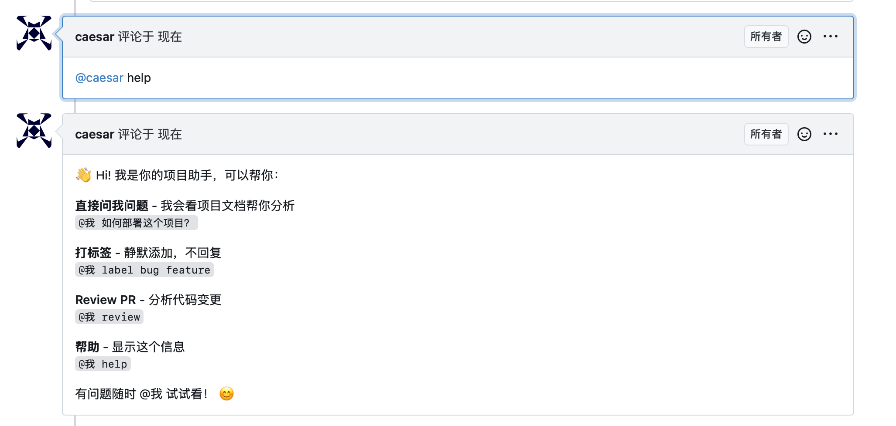

# GiteaCopilot

一个基于 LLM 的 Gitea 智能助手，能够自动执行代码审查（Code Review）、打标签、根据项目文档回答问题等任务。

**项目地址**: [github.com/kekxv/gitea-copilot](https://github.com/kekxv/gitea-copilot)

## ⚙️ 使用教程

### 1. 首页
首页的项目介绍



### 2. 管理界面设置
后台的设置页面，支持：host、webhook签名密钥、AI相关设置(openai 接口)



### 3. 注册gitea实例
通过添加gitea的应用，绑定到当前项目



### 4. 授权帐号
通过授权帐号，让对应帐号支持项目功能



### 5. 安全设置
支持修改密码，以及启用totp功能



## 🌟 核心功能展示

### 1. 🔍 专业代码审查 (Code Review)
深度分析 Pull Request 变更，提供精准到行的评审建议，涵盖逻辑缺陷、安全隐患及语义一致性检查。

| 审查总结 | 文件变动视图 |
| :--- | :--- |
|  |  |

### 2. 🧠 文档感知问答
基于项目 README、文档目录及自定义配置，像同事一样自然地回答您的技术问题。



### 3. 🏷️ 智能自动打标签
通过简单的指令 `@机器人 label bug feature` 即可快速为 Issue 或 PR 分类。



### 4. 🛠️ 交互式帮助
随时获取支持的操作列表。



## 🚀 快速开始

### 环境要求
- Python 3.10+
- Gitea 实例
- OpenAI 兼容的 LLM API (如 OpenAI, DeepSeek, Ollama 等)

### Docker 部署 (推荐)
```bash
# 拉取镜像
docker pull ghcr.io/kekxv/gitea-copilot:latest

# 运行容器
docker run -d \
  --name gitea-copilot \
  -p 8000:8000 \
  -v gitea-copilot-data:/app/data \
  -e LLM_BASE_URL=http://your-llm-server:11434/v1 \
  -e LLM_API_KEY=your-api-key \
  -e LLM_MODEL=your-model \
  ghcr.io/kekxv/gitea-copilot:latest
```

访问 `http://localhost:8000` 进入管理界面进行配置。

### 源码安装
1. **克隆仓库**:
   ```bash
   git clone https://github.com/kekxv/gitea-copilot.git
   cd gitea-copilot
   ```

2. **使用 uv 运行 (推荐)**:
   ```bash
   uv run main.py
   ```
   或者使用传统方式:
   ```bash
   pip install -r requirements.txt
   python main.py
   ```

3. **配置**: 
   - 启动后进入管理后台配置 Gitea 访问令牌及 LLM API 信息。
   - 在 Gitea 仓库中设置 Webhook。

## 🛡️ 安全与隐私
- **敏感信息过滤**: 系统内置高精度正则脱敏引擎，严禁在评论中泄露 Token、密码等隐私数据。
- **死循环防护**: 采用提及屏蔽技术，有效防止 Bot 自触发导致的死循环。

## 📄 开源协议
[MIT License](LICENSE)
