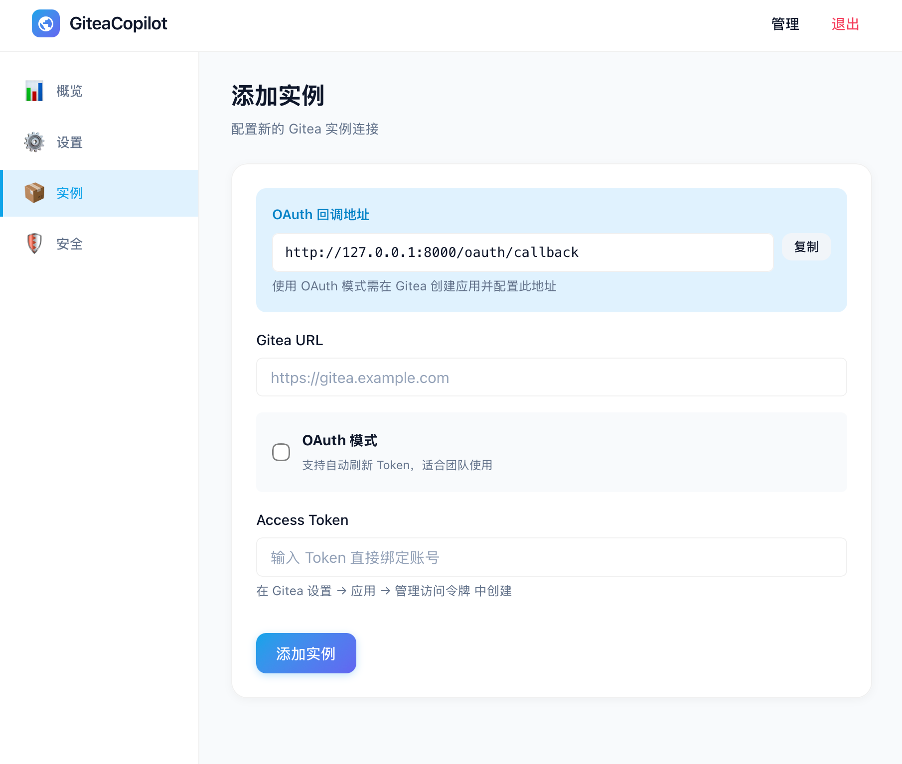
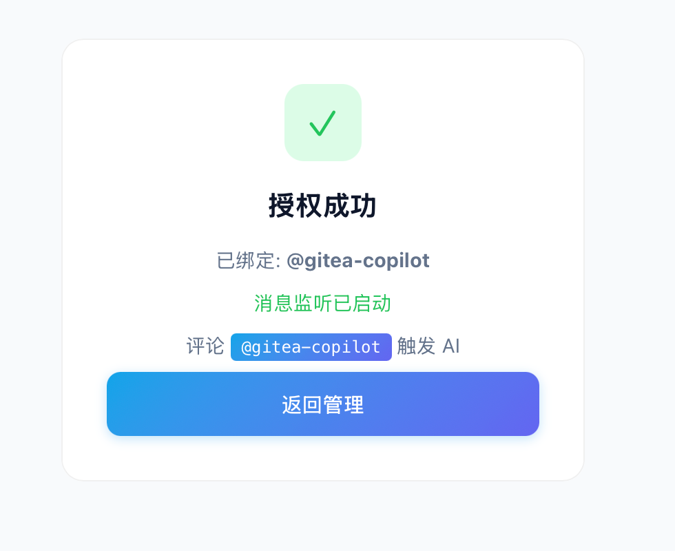

# GiteaCopilot

一个基于 LLM 的 Gitea 智能助手，能够自动执行代码审查（Code Review）、打标签、根据项目文档回答问题等任务。

**项目地址**: [github.com/kekxv/gitea-copilot](https://github.com/kekxv/gitea-copilot)

## ⚙️ 使用教程

### 1. 首页
首页的项目介绍


### 2. 管理界面设置
后台的设置页面，支持：host、webhook签名密钥、AI相关设置(openai 接口)


### 3. 注册gitea实例
通过添加gitea的应用，绑定到当前项目




### 4. 授权帐号
通过授权帐号，让对应帐号支持项目功能




### 5. 安全设置
支持修改密码，以及启用totp功能


## 🌟 核心功能展示

### 1. 🔍 专业代码审查 (Code Review)
深度分析 Pull Request 变更，提供精准到行的评审建议，涵盖逻辑缺陷、安全隐患及语义一致性检查。

**审查事件类型**：
- **COMMENT** - 仅发表评论，不阻止合并（适用于 LGTM 或一般建议）
- **REQUEST_CHANGES** - 要求修改后才能合并（发现问题时使用）

**安全限制**：
- AI 无法直接批准合并（APPROVED 会被自动转换为 COMMENT）
- Bot 不能对自己的 PR 发起 REQUEST_CHANGES（Gitea API 限制）

| 审查总结 | 文件变动视图 |
| :--- | :--- |
|  |  |

### 2. 🧠 文档感知问答
基于项目 README、文档目录及自定义配置，像同事一样自然地回答您的技术问题。


### 3. 🏷️ 智能自动打标签
通过简单的指令 `@机器人 label bug feature` 即可快速为 Issue 或 PR 分类。


### 4. ✅ 快捷状态操作
支持快速关闭或重新打开 Issue/PR：
- `@机器人 close` - 关闭当前 Issue/PR
- `@机器人 open` - 重新打开已关闭的 Issue/PR

### 5. 🛠️ 交互式帮助
随时获取支持的操作列表。


## 📋 支持的命令

在 Issue 或 PR 评论中 @机器人 并使用以下命令：

| 命令 | 说明 | 示例 |
| :--- | :--- | :--- |
| `help` / `帮助` / `?` | 显示帮助信息 | `@机器人 help` |
| `review` / `审核` / `审查` | 审查 PR 代码 | `@机器人 review` |
| `label <标签>` | 添加标签 | `@机器人 label bug feature` |
| `close` / `关闭` | 关闭 Issue/PR | `@机器人 close` |
| `open` / `打开` / `重开` | 重新打开 Issue/PR | `@机器人 open` |
| 直接提问 | 基于文档回答问题 | `@机器人 如何部署这个项目？` |

## 🚀 快速开始

### 环境要求
- Python 3.10+
- Gitea 实例
- OpenAI 兼容的 LLM API (如 OpenAI, DeepSeek, Ollama 等)

### 环境变量配置

系统支持通过环境变量进行配置，分为以下几类：

#### Token 模式（推荐简化部署）
使用 Gitea Token 直接访问，无需 OAuth 流程：

```bash
GITEA_URL=https://gitea.example.com    # Gitea 实例地址
GITEA_TOKEN=your-access-token           # Gitea 访问令牌
```

获取 Token：在 Gitea 设置 → 应用 → 管理访问令牌 中创建。

#### OAuth 模式（可选）
如果需要 OAuth 授权流程，可配置：

```bash
GITEA_CLIENT_ID=your-client-id          # OAuth 应用 Client ID
GITEA_CLIENT_SECRET=your-client-secret  # OAuth 应用 Client Secret
```

#### LLM 配置
支持两种环境变量命名方式：

```bash
# 方式一：LLM_* 变量
LLM_BASE_URL=https://api.openai.com/v1  # API 地址
LLM_API_KEY=your-api-key                 # API 密钥
LLM_MODEL=gpt-4o-mini                    # 模型名称

# 方式二：OPENAI_* 变量（兼容现有配置）
OPENAI_BASE_URL=https://api.openai.com/v1
OPENAI_API_KEY=your-api-key
OPENAI_MODEL=gpt-4o-mini
```

**优先级**: 数据库配置 > LLM_* 变量 > OPENAI_* 变量 > 默认值

### Docker 部署 (推荐)

#### Token 模式部署（最简单）
```bash
docker run -d \
  --name gitea-copilot \
  -p 8000:8000 \
  -v gitea-copilot-data:/app/data \
  -e GITEA_URL=https://gitea.example.com \
  -e GITEA_TOKEN=your-access-token \
  -e LLM_BASE_URL=https://api.openai.com/v1 \
  -e LLM_API_KEY=your-api-key \
  -e LLM_MODEL=gpt-4o-mini \
  ghcr.io/kekxv/gitea-copilot:latest
```

#### OAuth 模式部署
```bash
docker run -d \
  --name gitea-copilot \
  -p 8000:8000 \
  -v gitea-copilot-data:/app/data \
  -e LLM_BASE_URL=http://your-llm-server:11434/v1 \
  -e LLM_API_KEY=your-api-key \
  -e LLM_MODEL=your-model \
  ghcr.io/kekxv/gitea-copilot:latest
```

访问 `http://localhost:8000` 进入管理界面配置 OAuth。

### 源码安装
1. **克隆仓库**:
   ```bash
   git clone https://github.com/kekxv/gitea-copilot.git
   cd gitea-copilot
   ```

2. **使用 uv 运行 (推荐)**:
   ```bash
   # Token 模式
   export GITEA_URL=https://gitea.example.com
   export GITEA_TOKEN=your-access-token
   uv run main.py
   ```
   或者使用传统方式:
   ```bash
   pip install -r requirements.txt
   python main.py
   ```

3. **配置**: 
   - Token 模式：设置环境变量后自动初始化
   - OAuth 模式：进入管理后台配置 Gitea 实例

## 🔄 授权模式对比

| 特性 | Token 模式 | OAuth 模式 |
| :--- | :--- | :--- |
| 配置方式 | 环境变量 | 管理后台 + OAuth 流程 |
| Token 管理 | 手动更新 | 自动刷新 |
| 适用场景 | 个人/简单部署 | 多用户/企业部署 |
| 配置难度 | 低 | 中 |

## 🛡️ 安全与隐私
- **敏感信息过滤**: 系统内置高精度正则脱敏引擎，严禁在评论中泄露 Token、密码等隐私数据。
- **死循环防护**: 采用提及屏蔽技术，有效防止 Bot 自触发导致的死循环。

## 📄 开源协议
[MIT License](LICENSE)
